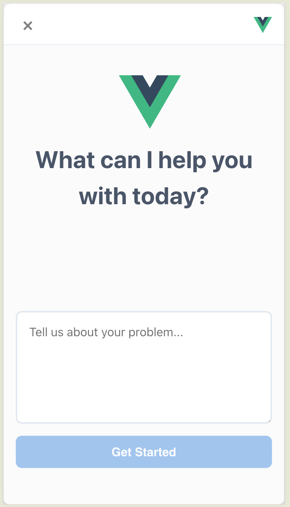
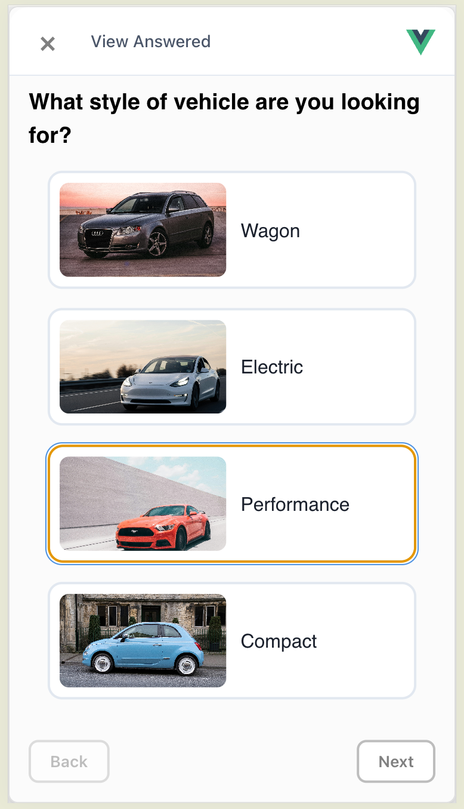
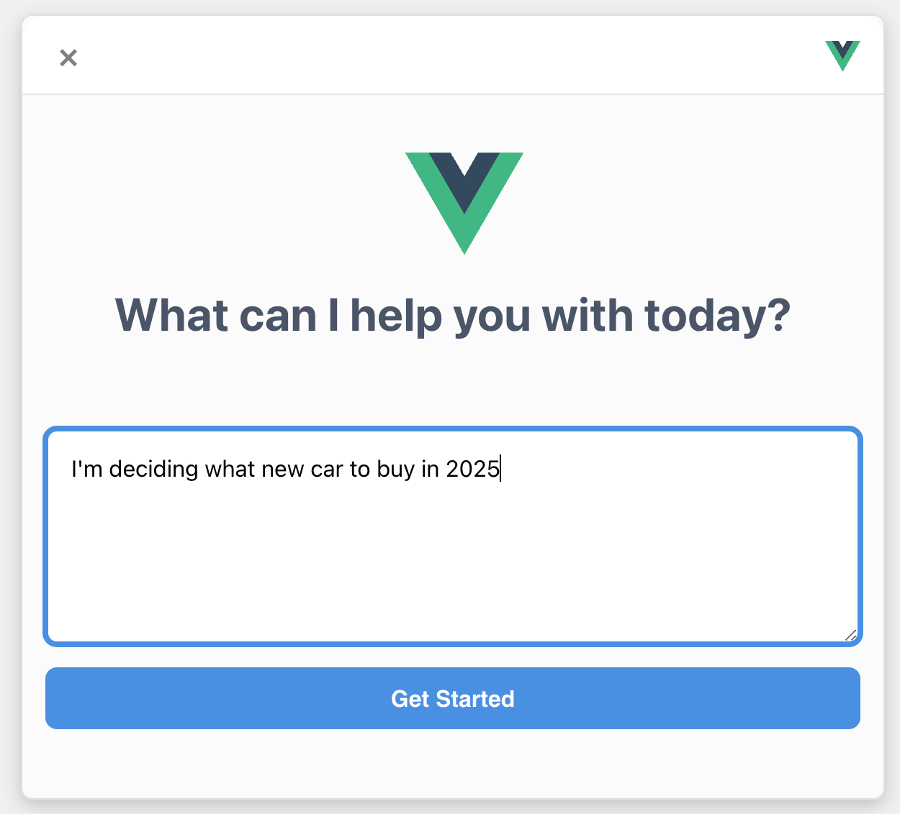
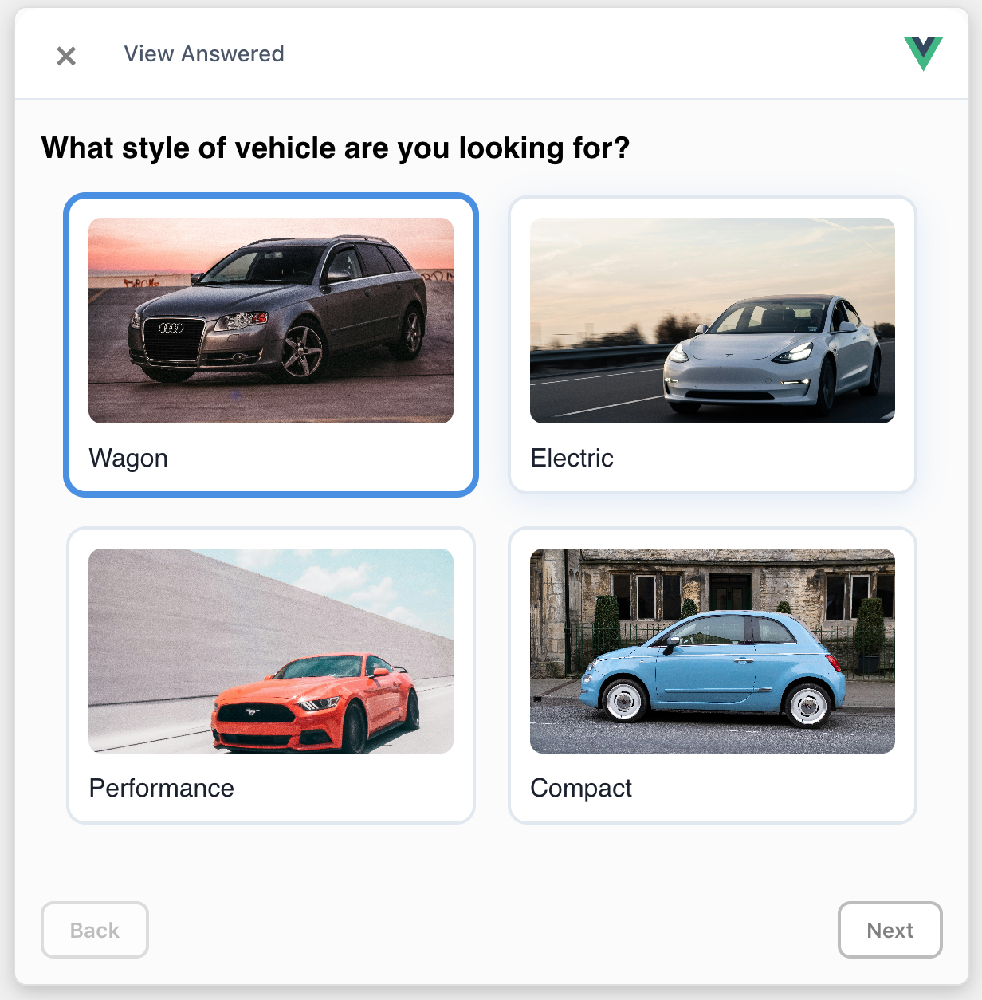
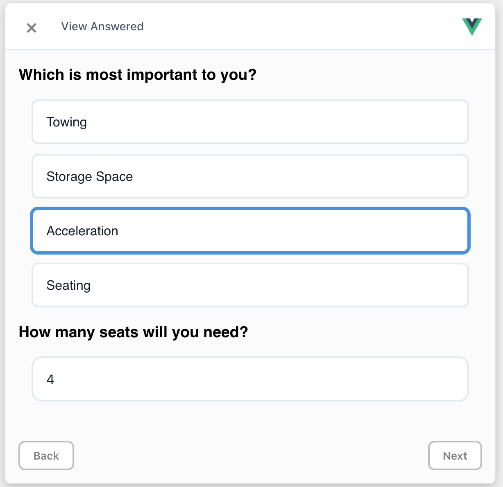

# Interactive Guidance Widget

An embeddable guidance widget that solves user needs asking questions.

## Demo

1. Install dependencies: `npm install`
2. Build widget: `npm run build:lib`
3. Serve the demo page: `npx serve public`
4. Open the demo page: `http://localhost:3000/demo.html`




## Features

- Prompt user for problem, ask them several questions (freeform text, numeric, multiple choice, images) presented as pages. Generates a recommended solution based on the answers.
- Customizable primary color, font family, font size, and border radius
- Customizable handlers for generating questions, generating a solution, and accepting feedback
- Answered tab to easily see all previous questions and answers
- Easy to embed and customize

## Usage

1. Include container in markup:

```html
<div id="guidance-widget"></div>
```

2. Initialize the widget:

```html
<script src="./guidance-widget.umd.js"></script>
<script>
  window.GuidanceWidget.init("guidance-widget");
</script>
```

## Configuration

This widget can be configured to display a custom logo on its top right corner.
Users can also customize the primary color, font family, font size, and border radius of UI elements. In the optional services object, users can provide custom code for generating questions from the problem provided, generating a solution based on all question answers, and accepting feedback from the user.

```ts
interface WidgetConfig {
  logoUrl?: string;
  styles?: {
    primaryColor?: string;
    fontFamily?: string;
    fontSize?: string;
    borderRadius?: string;
  };
  services?: {
    getQuestions?: () => Promise<Page[]>;
    generateSolution?: (request: SolutionRequest) => Promise<string>;
    submitFeedback?: (isHelpful: boolean, text?: string) => Promise<void>;
  };
}
```

## Using a custom configuration

```ts
window.GuidanceWidget.init("guidance-widget", {
  styles: {
    primaryColor: "#4a90e2",
    fontFamily: "Inter, system-ui, sans-serif",
    fontSize: "16px",
    borderRadius: "8px",
  },
});
```

## Screenshots


<br>Initial view of the widget


<br>Widget in action showing the chat interface


<br>Example of a completed interaction


<br>Responsive design on mobile
